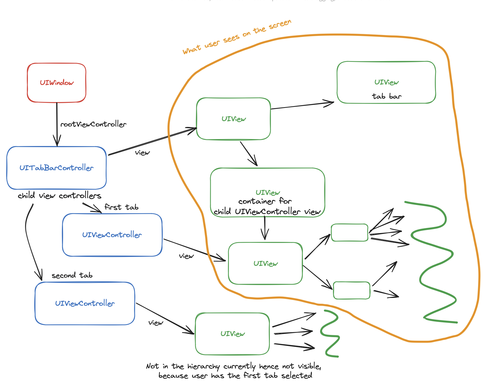
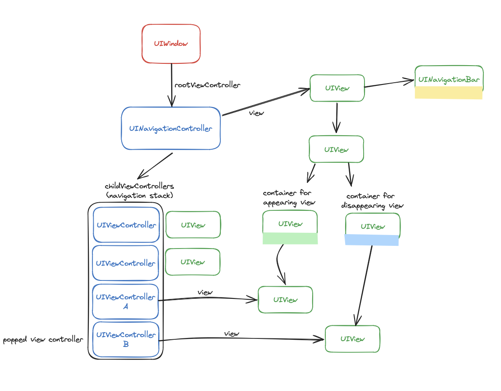
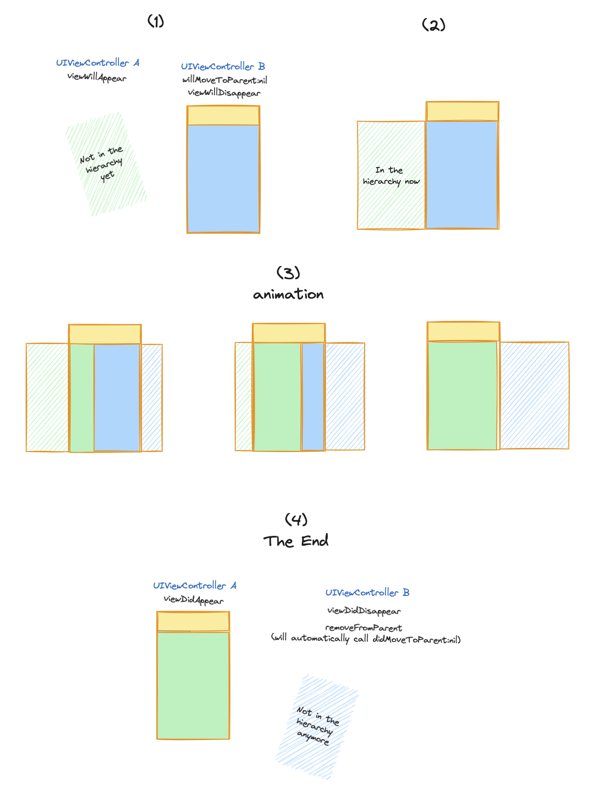
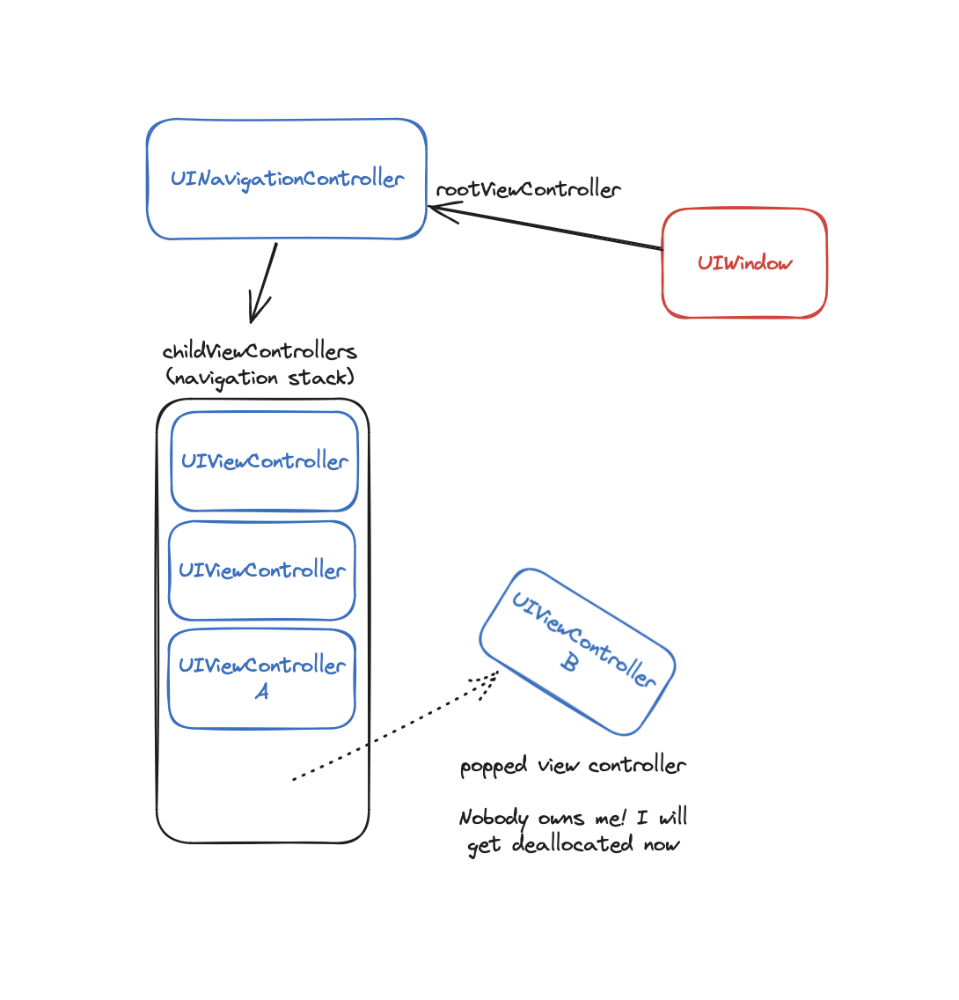
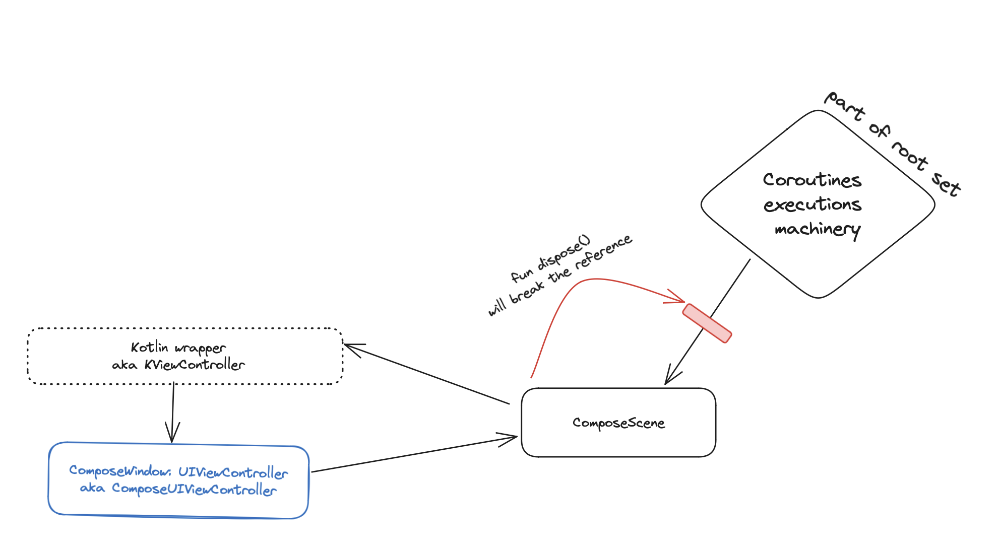
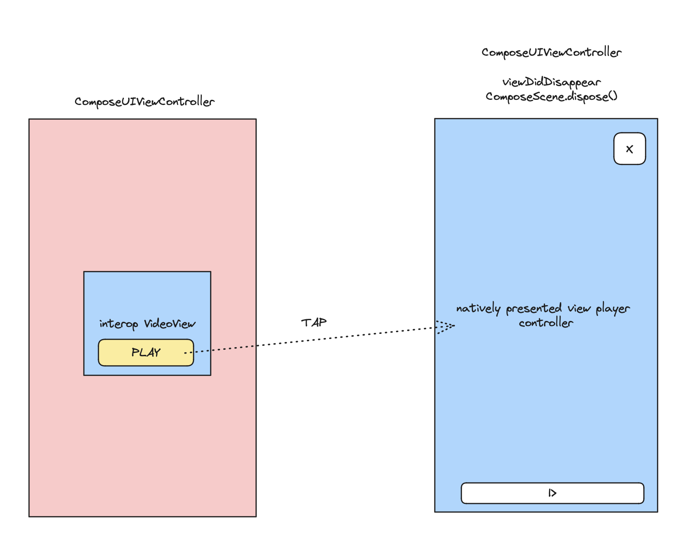
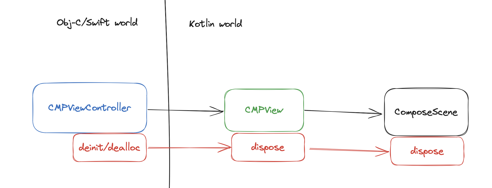

# Tractatum on life and death of `UIViewController` and `ComposeScene` in CMP world

## Intro

### The main problem
We need to free resources associated with `ComposeScene` in a determined and predictable way.
(and not forget about it)
### Summary

This document summarizes a set of interconnected problem related to lifetime of instances
of `UIViewController` and `ComposeScene` types in the scope of Compose Multiplatform and gives an
insight into how considered solutions to those problems are interfering with each other.

### iOS SDK overview

iOS applications are built on top of the `UIKit` framework. `CMP` just like `SwiftUI` encapsulates
and
manipulates `UIKit` objects.

There are three primary types in `UIKit` to be aware of to understand what's going on:

* `UIView` is a super class of widgets, contains logic for layout, touch handling, and drawing: e.g.
  label, text field, scroll.
* `UIViewController` represents full-fledged app components with rich semantics managing a tree
  of `UIView`s. View controllers themselves can be nested and form a tree.
* `UIWindow` representing fullscreen(for simplification) pane to which a `rootViewController` can be
  attached.

### Examples

A simple app could look like that:


But usually it's something more sophisticated, looking like that:


This whole thing is actually quite stateful and we can even stop the world in the middle of
navigation pop transition and it will look like that:


If we watch this transition in dynamic we will observe this sequence of events:


If you look closer, you will notice that there is no

```
viewControllerA.willMoveToParent(navigationController)
```

In this example it happened earlier during the app execution, when it was initially
pushed to the navigation stack, so the sequence of events looked like that:

```
navigationController.pushViewController(viewControllerA, animated: true)
// Implementation will call: 
// navigationController.addChild(viewControllerA)
// |---- viewControllerA.willMoveToParent(navigationController)
// ... animation ...
// viewControllerA.didMoveToParent(navigationController)
```

This state of affairs could possibly lead us to the idea, that `UIViewControler` being
a `rootViewController` of `UIWindow` or being a child controller of other `UIViewController` could
be something we could treat as "__state of being alive__".

## Stayin' alive

iOS SDK is designed around the languages with automatic reference counting (ARC). Both Swift and Obj-C rely on
concepts of strong ownership and weak references. The objects that don't have anybody who owns them
strongly get deallocated, all weak references still keep the control block allocated along with the
object alive, so the weak references could be unwrapped and see that the object is indeed dead,
instead of being a dangling pointer into somewhere the deallocated object resided.

Control block itself could be naively described by something like:

```kotlin
class ControlBlock(
    private var ptr: NativePtr, // pointer to the object itself
    var strongRefs: AtomicInt,
    var weakRefs: AtomicInt
) {
    // Sugar behind reference access
    fun resolvePtr(): NativePtr {
        if (strongRefs.get() == 0) {
            return 0 // null pointer
        }

        return ptr
    }
}
```

Let's see what happens with a `UIViewController`, that was popped in the previous chapter:

The `UIViewController` "B" gets immediately deallocated, because nobody owns it anymore. It released
the resources, that were uniquely referenced by it (let's say it had a `ComposeScene` inside).
Right?

Well. Not in our world. Let's imagine, our `UIViewController` "B" is a `ComposeWindow`.

#### Problem 1.

It can not happen _immediately_. Once `UIViewController` instance is passed to/created by Kotlin
runtime,
it will be owned by a Kotlin wrapper object (let's call it `KViewController`, that is controlled by
Kotlin rules and will not be
released earlier, than next GC pass, which will happen whenever, so we can't release associated
resources in
_determined_ way.

#### Problem 2.

From Kotlin runtime perspective, `ComposeScene` which is transitively referenced by
this `KViewController` also references `KViewController` indirectly. We pass `LocalUIViewController`
into our composition, so that users can use its API for interop purposes
(like `presentViewController` to modally show other view controllers). But that should not be a big
deal, mark-and-sweep GC will collect circular references unless one of them is referenced by
something in the root set.

The bad news is, something in _the root set_ is after us:

And we need to break this connection by calling `ComposeScene.dispose()`.
The problem is - who calls the `dispose()`?
How can `UIViewController` know that it needs to dispose the owned `ComposeScene`, its lifetime in
terms of automatic reference counting semantics is ruined in this case.

#### First approach

The initial take on implementing scene disposal
was [this PR](https://github.com/JetBrains/compose-multiplatform-core/pull/728).
It broke the strong connection between `ComposeScene` and `KViewController` via
using `WeakReference` and Kotlin Native `createCleaner` that allowed us to schedule some work at GC
time once the object is collected, making it a poor man destructor.
The view controller was collected and `createCleaner` lambda called `ComposeScene.dispose()`

This approach still had two disadvantages:

1. It happens at unknown time in the future when GC collects the `KViewController`
2. It's very fragile.

Let's have a look at this piece of code:

```kotlin
 @Composable
private fun Foo() {
    // LocalUIViewController.current is WeakReference<UIViewController>
    val viewController = LocalUIViewController.current.get() ?: return

    // can't use LocalUIViewController.current inside onClick because onClick is not @Composable
    Button(onClick = {
        val newViewController = UIViewController()
        viewController.presentViewController(newViewController, true)
    }) {
        Text("Present")
    }
}
```

We've just created a memory leak. `viewController` which is our `KViewController` is now captured
by `onClick` lambda and is hold inside Compose machinery. In order to release it, we need to
call `ComposeScene.dispose()` which will be called
when when `KViewController` is released, which is never, because it's a part of Compose execution
machinery and hence is referenced by the root set.

#### Second approach

What [if we use](https://github.com/JetBrains/compose-multiplatform-core/pull/747) `viewWillAppear`
to create `ComposeScene` and `viewDidDisappear` to destroy it.
It's determined. Seems like a good idea. There are disadvantages though:

1. We offload the responsibility to store the state of `ComposeScene` that should persist across
   scene resconstructions to the user.
2. Semantically incorrect code like custom `UIViewController` container, that didn't
   call `viewDidDisappear` will never `dispose` the scene.
3. Edge case below:


Interop video player view implicitly presents a over-fullscreen modal to expand the player,
causing `viewDidDisappear` call, subsequent `ComposeScene.dispose()`, destroying "interop VideoView"
which was created by composition that was a source of presented controller in a first place.

## Stayin` alive and dying ASAP while being correct

Since `lifetime` becomes a blurred and smudged term in the mix of two different runtimes we can try
to give authority to the runtime with predictable behavior.

### Enforce the lifetime semantics of automated reference counting

In order not to be tied to the garbage collector shenanigans, we can hide from it altogether.

The idea behind this approach is to design the CMP API in a way, where the `UIViewController` never
shows up in the Kotlin runtime in the first place.
The `UIViewController` will live as long as it's inside `UIViewController` hierarchy or some
Obj-C/Swift function scope.

#### Let's sketch the API

```kotlin
// CMPView.kt

// We will hide [weak self] of CMPViewController in those callbacks on ARC-world side.
class CMPViewControllerCallbacks(
    val presentViewController: (UIViewController, Bool) -> Unit
    // and other proxy methods, that user needs for the UIViewController
) : NSObject()

class CMPView(
    content: @Composable () -> Unit
) : UIView() {
    val composeScene = ComposeScene()

    // will be passed as composition local value to ComposeScene
    var callbacks: CMPViewControllerCallbacks? = null

    init {
        composeScene.setContent(content)
    }

    fun dispose() = composeScene.dispose()
}

private fun UIView.doIfCmpView(block: (CMPView) -> Unit) {
    val view = this
    if (view is CMPView) {
        block(view)
    }
}

fun UIView.cmpDispose() {
    doIfCmpView { it.dispose() }
}

fun UIView.cmpSetCallbacks(callbacks: CMPViewControllerCallbacks) {
    doIfCmpView { it.callbacks = callbacks }
}


```


```kotlin
// App.kt

fun makeView(): UIView =
    CMPView {
        // @Composable stuff
    }
```

```swift
// CMPViewController.swift

class CMPViewController: UIViewController {
   let cmpView: UIView
   
   init(cmpView: UIView) {
       self.cmpView = cmpView
   }
   
   deinit {
       cmpView.cmpDispose()
   }
   
   override func loadView() {
       view = cmpView
       
       // See what we did here? Kotlin can now use this lambda in its runtime, 
       // without seeing actual CMPViewController, but still utilizing ARC.
       // [weak self] is very powerful here, because it will retain the control block, allowing 
       // to safely unwrap it, which would be impossible if we use opaque pointer produced by 
       // `Unmanaged.passUnretained` API. Using `Unmanaged.fromOpaque` will be a Undefined Behavior 
       // (and hopefully a crash) if it's used after `CMPViewController` is deallocated.
       // So basically this allows us to keep the `CMPViewController` alive while something in 
       // ObjC/Swift owns it, while keeping the control block alive until this lambda 
       // is collected by Kotlin GC
              
       cmpView.cmpSetCallbacks(CMPLocalViewControllerCallbacks(
           presentViewController: { [weak self] viewController, animated in
               self?.present(viewController, animated: animated)
           }
       ))
   }
    
}
```

```swift
// App.swift

// ...
    window.rootViewController = CMPViewController(cmpView: makeView())
    // ...
    // the first one will be destroyed now and call `dispose` during `deinit`
    window.rootViewController = CMPViewController(cmpView: makeView())
// ...

```

That's a bit awkward API, because user will have to assemble `CMPViewController` with `CMPView`
inside on his own. `CMPView` requires a `@Composable` lambda as a constructor argument, which
is not possible to do in ObjC/Swift, and `CMPViewController` should never show up in the Kotlin
runtime.

Moreover, this approach sets a whole new bunch of restrictions. On the first sight this API looks
ok-ish:

```kotlin
@Composable
fun Foo() {
    val callbacks = LocalCMPViewControllerCallbacks.current

    Button(onClick = {
        callbacks.presentViewController(SomeViewController(), true)
    }) {
        Text("Present")
    }
}
```

But let's say, we want to present, or push to a navigation stack _another_ `CMPViewController`
here:

```kotlin
@Composable
fun Foo() {
    val callbacks = LocalCMPViewControllerCallbacks.current

    val composeViewController = ... ???
    // Oops, Kotlin doesn't know what CMPViewController is, and it's intended.

    Button(onClick = {
        callbacks.presentViewController(composeViewController, true)
    }) {
        Text("Present")
    }
}
```

What can we do with it? Well, we _could_ create an API like:

```kotlin
// Utils.kt

var generateCmpViewControllerOpaquePtrFromCmpView: ((UIView) -> NativePtr)? = null 
```

```swift
// Utils.swift

// Should be called somewhere
fun initCompose() {
    generateCmpViewControllerOpaquePtrFromCmpView = { cmpView in
        let viewController = CMPViewController(cmpView: cmpView)
        return Unmanaged.passRetained(viewController)
    }
}
```

So our code will look like that:

```kotlin
@Composable
fun Foo() {
    val callbacks = LocalCMPViewControllerCallbacks.current

    val composeViewControllerRawPtr = generateCmpViewControllerOpaquePtrFromCmpView(CMPView {
        // @Composable stuff
    })

    Button(onClick = {
        // we will need a new callback, that will interpret NativePtr as an argument 
        // for Unmanaged<CMPViewController>.fromOpaque and unwrap the CMPViewController 
        // in ObjC world, already unsafe 
        callbacks.presentViewControllerRawPtr(composeViewControllerRawPtr, true)
    }) {
        Text("Present")
    }
}
```

But... Who releases this `NativePtr` representing `Unmanaged<CMPViewController>`?
`presentViewControllerRawPtr` can't do it, because we can't guarantee, that it will be called only
once with a given instance. Offloading this responsibility to the user creates a fragile API with
lot of invariants to maintain without a language help, that _will_ lead to inevitable UBs, crashes
and memory leaks.

Maybe do our trick again with lambdas again?

```swift
// Swift
cmpView.cmpSetCallbacks(CMPLocalViewControllerCallbacks(
    // ...
    presentViewControllerFromCmpView: { [weak self] view, animated in
        self?.present(CMPViewController(cmpView: view), animated: animated)
    }
))
```

```kotlin
// Kotlin

class CMPViewControllerCallbacks(
    // ...
    // another callback
    val presentViewControllerFromCmpView: (UIView, Boolean) -> Unit
) : NSObject()

@Composable
fun Foo() {
    val callbacks = LocalCMPViewControllerCallbacks.current

    val composeViewControllerRawPtr = generateCmpViewControllerOpaquePtrFromCmpView(CMPView {
        // @Composable stuff
    })

    Button(onClick = {
        callbacks.presentViewControllerFromCmpView(composeViewControllerRawPtr, true)
    }) {
        Text("Present")
    }
}
```

Looks fine. This should work. Still it could be broken in a million of ways. We explicitly design
the API to protect the user from passing `CMPViewController` to Kotlin, but nobody protects the user
from accidently capturing `presentingViewController` in a lambda. Moreover, we will need to thoroughly 
explore every usecase like... We don't want a modal presentation, we want to push something onto
navigation stack:
```kotlin
// UINavigationController doesn't know about stuff like `pushViewControllerFromCmpView`
callbacks.navigationController?.pushViewController(/* what do we write here?*/)
```
It seems like this path will lead to thorough mapping of all possible APIs to protect our 
`CMPViewController` from the Kotlin runtime. 

We have the same question again:
_Who owns what, what is a __lifetime__ and who is responsible for disposing things._
Let's explore another options?

### Reusing some determined SDK capabilites to reinvent lifetime meaning

There was a remark in the `Examples` chapter:

> This state of affairs could possibly lead us to the idea, that `UIViewControler` being a
> `rootViewController` of `UIWindow` or being a child controller of other `UIViewController`
> could be something we could treat as "state of being alive".

So basically, once `UIViewController.willMoveToParent` is called or it becomes a
`rootViewController`, it creates a `ComposeScene`, once it goes out, it destroys it. Seems to cover
pretty much all the cases. We make our _lifetime_ a property of current hierarchy structure.

As you could already guess, there is a problem again:

```swift
// App.swift

class ViewController: UIViewController {
    override func viewDidAppear(_ animated: Bool) {
        super.viewDidAppear(animated)
        
        DispatchQueue.main.asyncAfter(deadline: .now() + 2.0) {
            let navigationController = UINavigationController(rootViewController: FooViewController())
            self.present(navigationController, animated: true)
        }
    }
}

class FooViewController: UIViewController {
    override func viewDidLoad() {
        super.viewDidLoad()
        
        view.backgroundColor = .green
        view.isUserInteractionEnabled = true
    }
    
    override func willMove(toParent parent: UIViewController?) {
        super.willMove(toParent: parent)
        
        print("willMove to",parent)
    }
}

```

`willMove to nil` will never be printed if a user swipes down modally presented navigation stack
with our `FooViewController`. The whole hierarchy of `UINavigationController`->`FooViewController`
will just cease to exist, leaving us hanging if we tie our `ComposeScene` lifetime to it.
Technically, `FooViewController` never moved to `nil` parent, it's a `UINavigationController`
whose `view` was detached from the `window`.

We could go the other way and treat attaching and detaching from `window` as an event to take decisions
about what our lifetime stage is. It is closely related to `viewWillAppear`, `viewDidDisappear`,
but in this case things get even worse, because `window` value is not really semantical, but a
structural attribute. It means every time
`UINavigationController` will modify internal `UIView` structure for animation purposes, a short
detach of `UIView` from `UIWindow` to put it in some other place will still lead to `ComposeScene`
disposal because in the moment, the `window` would be `nil`.

We jumped through hoops to predict the sequence of events, after which the object will possibly get deallocated 
in a native app, but still failed.

Moreover, nobody can guaruantee whether the `viewDidDisappear` or `window` set to `nil` is the last
thing that happened to the object. It will lead to problems once work on commonizing
[Android activity lifecycle](https://developer.android.com/guide/components/activities/activity-lifecycle) starts. 
There is no way to maintain those invariants when using an approach above:
1. `onDestroy` is called once.
2. `onDestroy` is called in determined way.

### What to do

As you can see, those games with interop and embedding doesn't do us any favors because 
iOS SDK is designed with ARC in mind. In Android the system manages the activities, in a similar 
way, our planned navigation library could take the same responsibility. 

A general case solution doesn't seem to be possible with all our constraints in mind.
We should explore specific scenariors of using CMP and focus on them, prohibiting other ones.

Fow now, we have only one scenario, which has a clear obvious solution:

We don't need `ComposeScene` disposal for a single `ComposeWindow` app, just create it and leave it be.

