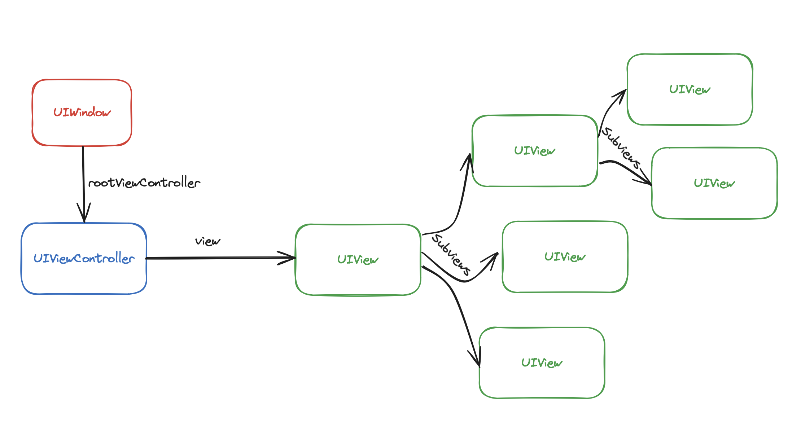

# Tractatum on life and death of `UIViewController`s and `ComposeScene`s in CMP world

## Intro

### Summary

This document summarizes a set of interconnected problem related to lifetime of instances
of `UIViewController` and `ComposeScene` types in the scope of Compose Multiplatform and gives an
insight into how considered solutions to those problems are intefering with each other.

### iOS architecture overview

iOS applications are built on top of the `UIKit` framework. `CMP` just like `SwiftUI` encapsulates and
manipulates `UIKit` objects.

There are three primary types in `UIKit` to be aware of to understand what's going on:

* `UIView` is a super class of widgets, contains logic for layout, touch handling, and drawing: e.g. label, text field, scroll.
* `UIViewController` represents full-fledged app components with rich semantics managing a tree
  of `UIView`s. View controllers themselves can be nested and form a tree.
* `UIWindow` representing fullscreen(for simplification) pane to which a `rootViewController` can be
  attached.

#### Hierarchy examples
A simple app could look like that:

But usually it's something more sophisticated, looking like that:
